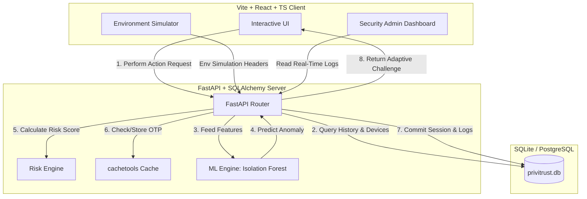
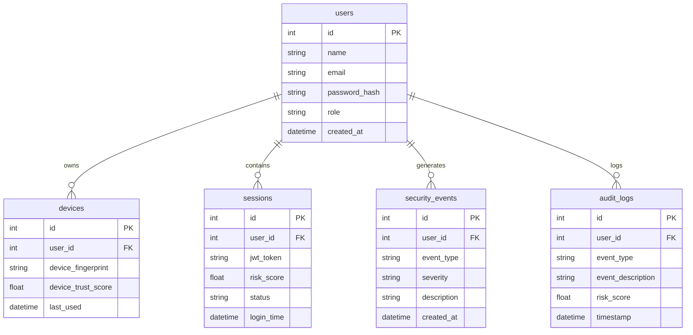

# PriviTrust AI: Presentation Pitch Deck & Technical Explainer
*Continuous Identity Trust Framework for Privileged Access Security*

---

## 🎙️ The Pitch (The "Why")

### The Problem
Traditional cybersecurity operates on a **perimeter-based model**—once a user passes authentication (even with MFA), they are granted a session token that remains valid for hours (or days). If their session is hijacked (via session cookie theft, man-in-the-middle, or local console takeovers), or if a malicious insider turns rogue, the traditional security layers are **blind**. 

> **"Trust is a decay curve. Authenticating once is no longer enough."**

### The Solution: PriviTrust AI
**PriviTrust AI** shifts security from a "one-and-done" login process to a **Continuous Identity Trust Framework**. 
- It treats trust as a dynamic score that must be re-evaluated for **every single action** inside a privileged session.
- By tracking environmental factors and running user behaviors through a local, pre-trained **Machine Learning anomaly detector (Isolation Forest)**, the backend calculates risk in real-time.
- If risk peaks, the system dynamically scales verification—seamless execution, MFA challenges, re-authentications, or immediate session locks.

---

## 🛠️ System Architecture

PriviTrust AI utilizes a modern, containerized three-tier architecture:

### Technical Components:
1. **Frontend (Vite + React + TypeScript + Custom CSS):** A dark-mode, premium banking-themed interface. Includes:
   - **User Workspace:** Where privileged users (Alice) execute daily actions.
   - **Environment Simulator:** Real-time toggling of client IP, device trust status, simulated action times, and transaction volumes.
   - **Security Admin Dashboard:** Real-time SVG charting, network risk trends, interactive logs ticker, and compliance CSV export.
2. **Backend (Python + FastAPI):** Highly optimized, asynchronous web server exposing auth, monitoring, user, and action routes.
3. **ML Engine (Scikit-Learn - Isolation Forest):** Automatically trained on startup using 7 days of normal baseline work shifts (330+ seeded records). Detects outliers in access hours, weekend actions, and severity levels.
4. **Relational Database (SQLAlchemy + SQLite):** ACID-compliant persistence tracking users, trusted device fingerprints, active sessions, raised security threats, and detailed audit trails.

---

## 🧮 The Risk Scoring Formula

The system computes session risk using an additive scoring engine based on five critical parameters:

$$\text{Risk Score} = (D \times 30) + (A \times 25) + (E \times 20) + (O \times 15) + (F \times 10)$$

Where:
- **$D$ (New/Untrusted Device):** Weight = $30$. Evaluated using browser-specific device fingerprints.
- **$A$ (Abnormal Behavior - ML Anomaly):** Weight = $25$. Determined dynamically by the **Isolation Forest** classifier based on access patterns.
- **$E$ (Excessive Access Rate/Volume):** Weight = $20$. Triggered by request size (>10 items) or rate-limiting (more than 5 actions/minute).
- **$O$ (Off-Hours Activity):** Weight = $15$. Triggers when actions occur outside normal business hours (18:00 to 08:00).
- **$F$ (Recent Failed Logins):** Weight = $10$. Flagged if there are recent failed password entries cached for the user.

---

## 🔄 Adaptive Security Actions (The Trust Bands)

Depending on the calculated risk score (from $0$ to $100$), the system falls into one of four trust bands, adjusting authorization requirements dynamically:

| Risk Score | Trust Level | Action Taken | User Experience |
| :--- | :---: | :--- | :--- |
| **$0$ - $30$** | **Low** | **Seamless Execution** | Action completes immediately with zero friction. |
| **$31$ - $60$** | **Medium** | **MFA OTP Challenge** | Prompts user with a 2-minute time-locked OTP (simulated via cachetools). |
| **$61$ - $80$** | **High** | **Re-Authentication** | Requires user to re-enter their password to verify identity. |
| **$81$ - $100$** | **Critical** | **Immediate Session Lock** | Locks session in DB, blocks requests, and redirects user to a blocked screen. Logs a **Critical Security Event** visible to Admins. |

---

## 💾 Relational Database Schema

---

## 🚀 Live Demo Walkthrough (Winning the Judges)

To present a flawless demo, walk the judges through the simulator's stages:

### Step 1: Normal Operation (Low Risk)
- **Action:** Log in as **Alice** (Privileged Support). Click **Verify Customer Identity**.
- **Under the Hood:** Device is trusted, normal work hours, low volume.
- **Risk Score:** $\le 30$.
- **Result:** Seamless execution.

### Step 2: Medium Risk (OTP Verification)
- **Action:** Toggle off **"Force Device Trusted Status"** in the simulator. Click **Query Customer Transactions**.
- **Under the Hood:** $D=30$ (new device) + normal baseline = risk score $40$.
- **Result:** Interactive OTP modal blocks workspace. A mock SMS notification slides in with the OTP cached in `cachetools`. Entering the OTP unlocks the action.

### Step 3: High Risk (Re-Authentication)
- **Action:** Set time override to night hours (`23:00`), keep device untrusted. Click **Bulk Account Records Export**.
- **Under the Hood:** $D=30$ (new device) + $O=15$ (night-shift) + $E=20$ (bulk action volume) = risk score $65$.
- **Result:** UI triggers password re-authentication. Alice enters her password, and the CSV file is safely exported.

### Step 4: Critical Risk (Active Breach Prevention)
- **Action:** Keep device untrusted and off-hours (`23:00`). Attempt a highly sensitive action like **Restart Core Services** or **Modify System Permissions**.
- **Under the Hood:** $D=30$ + $O=15$ + $E=20$ + $A=25$ (critical severity triggers ML anomaly) = risk score $90$.
- **Result:** The system terminates the session immediately. Alice is locked out and redirected to a blocked page.

### Step 5: The Security Dashboard
- **Action:** Log out and sign in as the **Security Admin**.
- **Result:** Show the real-time SVG charts showing the threat spiked to $90$, active session counts, the locked audit log, and the **Live Threat Warnings** ticker containing the critical alert. Explain that this is what a Chief Information Security Officer (CISO) sees in real time.
